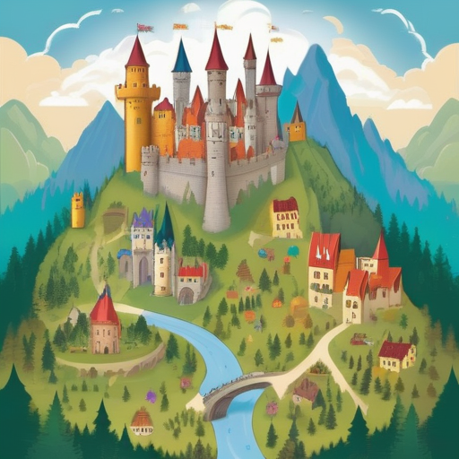

[← Back to Book Home](index.md)

# Kingdom Places

Greetings, young explorer! Our magical kingdom has many wonderful places to visit and explore!

## Our Kingdom Map

Our kingdom is like a big puzzle made of smaller pieces. We have:

* One big castle where the King and Queen live
* Smaller castles called Baronies
* Friendly villages called Shires
* Special training grounds called Colleges

All these places fit together to make our whole kingdom!

## Castles and Villages

Each place in our kingdom has its own:

* Special name
* Flag with pretty colors and pictures
* Group of friends who live there
* Leaders who help take care of everyone

Some places are big with lots of friends, and some are small with just a few friends. But all places are important!

## Finding Places

When you want to find a place on our kingdom map:

1. Look for the name of the place
2. See what type of place it is (castle, village, etc.)
3. Find out who the leaders are
4. See what fun activities happen there

I help keep track of all the places so we always know where everything is!

## Your Home in the Kingdom

Every friend in our kingdom lives in one of these special places. When you join our kingdom, you get to pick which place will be your home!

You can visit other places for fun activities, but your home place is where your closest kingdom friends will be.

[← Previous: Making Friends](2-making-friends.md) | [Next: Royal Helpers →](4-royal-helpers.md)