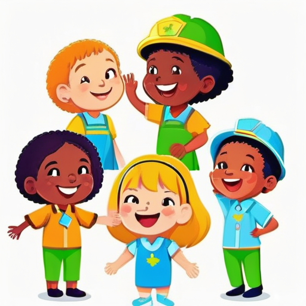

[← Back to Book Home](index.md)

# Royal Helpers

Hello, royal friend! Every kingdom needs special helpers to keep things running smoothly!

## Kingdom Jobs

In our magical kingdom, many grown-ups volunteer to be special helpers. We call these helpers "officers." Each officer has an important job:

* The Seneschal helps the King and Queen run the kingdom
* The Herald announces important news and helps with special names
* The Knight Marshal teaches safe fighting with soft swords
* The Minister of Arts teaches fun crafts like painting and sewing
* The Exchequer counts the kingdom's gold coins

## Helper Badges

Every royal helper wears a special badge that shows what job they do. When you see someone with a badge, you know they can help you with certain things!

For example, if you want to learn how to make a paper crown, you can find the Minister of Arts. If you want to learn how to play safely with foam swords, find the Knight Marshal!

## Becoming a Helper

When grown-ups want to become royal helpers:

1. They tell the kingdom they want to help
2. They learn about the special job
3. They get a "warrant" (that's like a special permission paper)
4. They get their helper badge
5. They start helping everyone in the kingdom!

Most helpers work for one or two years before giving the job to a new helper.

## Helper Teams

Some royal helpers have a team of friends who help them do their job. For example:

* The Knight Marshal has fighting teachers
* The Minister of Arts has craft teachers
* The Herald has name helpers

Working together makes the kingdom run smoothly and keeps everyone happy!

[← Previous: Kingdom Places](3-kingdom-places.md) | [Next: Special Awards →](5-special-awards.md)