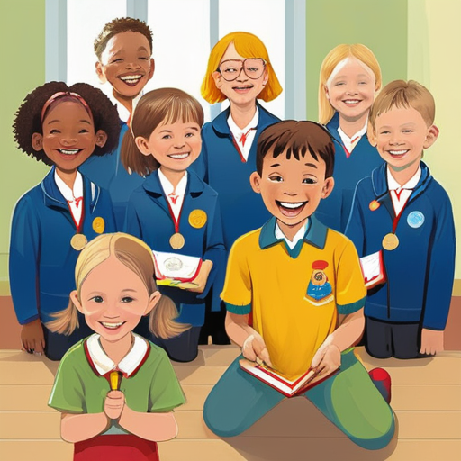

[← Back to Book Home](index.md)

# Special Awards

Greetings, noble friend! In our kingdom, we love to celebrate when someone does something amazing!

## Kingdom Treasures

When someone in our kingdom does something really special, they might receive an award. Awards are like special treasures that show everyone what amazing things you've done!

Some awards are:

* Pretty medallions to wear around your neck
* Colorful ribbons to wear on your clothes
* Fancy scrolls with your name written in beautiful letters
* New titles to add to your special kingdom name

## Why We Give Awards

We give awards to friends who:

* Are extra kind and helpful to others
* Learn new skills and become really good at them
* Teach others how to do fun things
* Help make the kingdom a better place for everyone

Everyone in the kingdom can earn awards by being their best self!

## How Awards Work

When someone thinks you deserve an award:

1. They write a letter to the King and Queen about your good deeds
2. The King and Queen think about which award would be right for you
3. They keep it a secret until a special ceremony
4. At the ceremony, they call your name and give you your award
5. Everyone claps and cheers for you!

I help keep track of all the award recommendations and who has received which awards.

## Your Award Collection

As you spend time in our kingdom and learn new skills, you might collect many different awards! Each one tells a story about something special you did.

Some friends have been in the kingdom for many years and have lots of awards. Maybe someday you'll have a big collection too!

[← Previous: Royal Helpers](4-royal-helpers.md) | [Next: Fun Activities →](6-fun-activities.md)