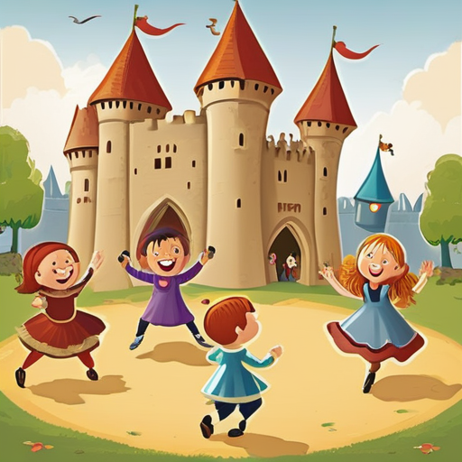

[← Back to Book Home](index.md)

# Fun Activities

Hello, playful friend! Our kingdom is full of exciting activities and adventures!

## Kingdom Events

Throughout the year, our kingdom has many special events where friends gather to play and learn:

* Big festivals with music, dancing, and yummy food
* Tournaments where knights play fighting games with soft swords
* Arts days where everyone makes beautiful crafts
* Special feasts with delicious meals and fun stories

I help keep track of all these events so everyone knows when and where they will happen!

## Joining the Fun

When you want to go to a kingdom event:

1. Look at the kingdom calendar to find an event you like
2. Ask a grown-up to help you sign up
3. Pack your special kingdom clothes and toys
4. Go to the event and have lots of fun!

Some events are small with just a few friends, and some are huge with hundreds of friends from all over the kingdom!

## Learning New Skills

At kingdom events, you can learn many exciting skills:

* How to make pretty jewelry
* How to paint colorful pictures
* How to play medieval games
* How to dance like they did in olden times
* How to make simple costumes

Every time you go to an event, you might learn something new!

## Helping with Events

Grown-ups help make events happen by:

* Finding a place for the event
* Planning fun activities
* Making food for everyone
* Setting up tables and chairs
* Cleaning up after the event

I help the grown-ups keep track of who's helping with what so that events run smoothly and everyone has a good time!

## Your Adventure Book

Each time you go to an event, it's like adding a page to your own adventure book. After many years in the kingdom, you'll have wonderful memories of all the fun you've had and friends you've made!

[← Previous: Special Awards](5-special-awards.md) | [Back to Book Home](index.md)