# Office Reporting Structure

This document shows the hierarchical reporting relationships between offices in the Kingdom Management Portal (KMP). Each department has its own diagram for clarity.

---

## 🏰 Nobility

```mermaid
flowchart TD
    Crown["👑 Crown"]
    Coronet["👑 Coronet"]
    PS["👑 Principality Sovereign"]
    LL["Local Landed"]
    
    LL --> Crown
```

---

## 📜 Seneschallate

---

## ⚔️ Marshallate

The Marshallate is the largest department. It's broken into sub-sections for readability.

### Earl Marshal Overview

### Armored Combat Branch

### Rapier Combat Branch

### Equestrian Branch

### Missile Combat Branch

---

## 🎨 Arts & Sciences

---

## 💻 Webministry

---

## 💰 Treasury

---

## 🏠 Chatelaine

---

## 📰 Chronicler

---

## 🛡️ College of Heralds

---

## 👨‍👩‍👧‍👦 Youth and Family Office

---

## Office Count Summary

| Department | Total Offices |
|------------|---------------|
| Marshallate | 47 |
| Seneschallate | 10 |
| Arts & Sciences | 4 |
| Webministry | 5 |
| Treasury | 5 |
| Chatelaine | 5 |
| Chronicler | 5 |
| College of Heralds | 6 |
| Youth and Family Office | 3 |
| Nobility | 4 |
| **Total** | **94** |

---

*Generated from KMP database on December 8, 2025*
