# User Flow Diagrams - Gathering Waiver Tracking System

**Feature**: 001-build-out-waiver  
**Date**: October 20, 2025

This document provides visual diagrams of the three main user workflows in the Gathering Waiver Tracking System.

---

## Flow 1: Configuring the Baseline System

**User Role**: Kingdom Officer  
**Frequency**: Initial setup, then occasional updates  
**Purpose**: Configure the types and policies that define how the system operates

```mermaid
flowchart TD
    Start([Kingdom Officer Logs In]) --> NavConfig[Navigate to Configuration]
    
    subgraph "Step 1: Configure Gathering Types"
        NavConfig --> ViewGT[View Gathering Types List]
        ViewGT --> AddGT{Add New Type?}
        AddGT -->|Yes| CreateGT[Create Gathering Type]
        CreateGT --> InputGT[Enter: Name, Description]
        InputGT --> SaveGT[Save Gathering Type]
        SaveGT --> ViewGT
        AddGT -->|No| NextStep1[Proceed to Waiver Types]
    end
    
    subgraph "Step 2: Configure Waiver Types"
        NextStep1 --> ViewWT[View Waiver Types List]
        ViewWT --> AddWT{Add New Type?}
        AddWT -->|Yes| CreateWT[Create Waiver Type]
        CreateWT --> InputWT[Enter: Name, Description]
        InputWT --> UploadTemplate[Upload Blank Waiver Template]
        UploadTemplate --> SetRetention[Set Retention Policy]
        SetRetention --> RetentionExample["Example: 7 years + 6 months"]
        RetentionExample --> SaveWT[Save Waiver Type]
        SaveWT --> ViewWT
        AddWT -->|No| NextStep2[Proceed to Activity Linking]
    end
    
    subgraph "Step 3: Link Activities to Waiver Types"
        NextStep2 --> ViewActivities[View Standard Activities]
        ViewActivities --> SelectActivity[Select Activity<br/>e.g., 'Armored Combat']
        SelectActivity --> LinkWaivers[Link Required Waivers]
        LinkWaivers --> Example1["✓ Adult General Waiver"]
        Example1 --> Example2["✓ Armored Combat Waiver"]
        Example2 --> SaveLinks[Save Activity-Waiver Links]
        SaveLinks --> MoreActivities{More Activities<br/>to Configure?}
        MoreActivities -->|Yes| ViewActivities
        MoreActivities -->|No| Complete1
    end
    
    Complete1([Configuration Complete!]) --> SystemReady[System Ready for Gatherings]
    
    style Start fill:#e3f2fd
    style Complete1 fill:#c8e6c9
    style SystemReady fill:#c8e6c9
    style CreateGT fill:#fff9c4
    style CreateWT fill:#fff9c4
    style SetRetention fill:#ffccbc
    style LinkWaivers fill:#f8bbd0
```

### Key Configuration Elements

| Element | Example | Purpose |
|---------|---------|---------|
| **Gathering Type** | "Practice", "Tournament", "War" | Categorizes gatherings |
| **Waiver Type** | "Adult General", "Minor", "Armored Combat" | Defines waiver categories |
| **Retention Policy** | 7 years + 6 months | Legal requirement for document storage |
| **Activity-Waiver Link** | Armored Combat → Adult + Combat waivers | Auto-determines required waivers |

---

## Flow 2: Creating a Gathering

**User Role**: Gathering Steward or Kingdom Officer  
**Frequency**: Before each gathering event  
**Purpose**: Set up a specific gathering and define its activities

### What Happens Next

After gathering creation:
1. **Steward receives confirmation** with gathering ID
2. **System knows required waivers** based on activities selected
3. **Gathering appears in list** for waiver upload
4. **Participants can begin uploading** waivers (next flow)

---

## Flow 3: Uploading Waivers for a Gathering

**User Role**: Gathering Steward (on-site or office)  
**Frequency**: During or after each gathering  
**Purpose**: Capture participant waivers and convert to PDFs

```mermaid
flowchart TD
    Start([Steward at Gathering Site]) --> Device{Device Type?}
    
    %% Mobile Flow
    Device -->|Mobile/Tablet| MobileNav[Open KMP on Mobile]
    MobileNav --> MobileLogin[Login]
    MobileLogin --> SelectGathering1[Select Gathering<br/>from List]
    SelectGathering1 --> ViewRequired["View Required Waivers:<br/>✓ Adult General<br/>✓ Armored Combat"]
    ViewRequired --> StartUpload[Tap 'Upload Waivers']
    StartUpload --> CameraPrompt[System Prompts<br/>Camera Permission]
    CameraPrompt --> AllowCamera{Allow Camera<br/>Access?}
    AllowCamera -->|No| ManualUpload[Use File Picker Instead]
    AllowCamera -->|Yes| OpenCamera[Mobile Camera Opens]
    
    subgraph "Mobile Camera Capture"
        OpenCamera --> TakePhoto1[Take Photo of Waiver 1]
        TakePhoto1 --> Preview1[Preview Photo]
        Preview1 --> Retake1{Photo OK?}
        Retake1 -->|No| TakePhoto1
        Retake1 -->|Yes| TakePhoto2[Take Photo of Waiver 2]
        TakePhoto2 --> Preview2[Preview Photo]
        Preview2 --> Retake2{Photo OK?}
        Retake2 -->|No| TakePhoto2
        Retake2 -->|Yes| MorePhotos{More Waivers?}
        MorePhotos -->|Yes| TakePhoto2
        MorePhotos -->|No| ReviewBatch
    end
    
    %% Desktop Flow
    Device -->|Desktop| DesktopNav[Open KMP on Desktop]
    DesktopNav --> DesktopLogin[Login]
    DesktopLogin --> SelectGathering2[Select Gathering<br/>from List]
    SelectGathering2 --> DesktopUpload[Click 'Upload Waivers']
    DesktopUpload --> DragDrop[Drag & Drop<br/>or Browse Files]
    DragDrop --> ReviewBatch
    ManualUpload --> ReviewBatch
    
    subgraph "Batch Review & Processing"
        ReviewBatch[Review All Selected Images]
        ReviewBatch --> ShowThumbnails["Shows: 5 images selected<br/>Total: 15.2 MB"]
        ShowThumbnails --> ValidateFiles[System Validates Files]
        ValidateFiles --> CheckFormat{All JPEG/PNG?}
        CheckFormat -->|No| ErrorFormat[Error: Invalid Format<br/>Remove Problem Files]
        ErrorFormat --> ReviewBatch
        CheckFormat -->|Yes| CheckSize{All Under 10MB?}
        CheckSize -->|No| ErrorSize[Error: File Too Large<br/>Remove Problem Files]
        ErrorSize --> ReviewBatch
        CheckSize -->|Yes| OptionalMember[Optionally Link to Member]
        OptionalMember --> SubmitBatch[Submit Batch Upload]
    end
    
    subgraph "Server Processing"
        SubmitBatch --> QueueJobs[Queue Conversion Jobs]
        QueueJobs --> Progress[Show Progress Bar]
        Progress --> Convert1["Converting 1 of 5...<br/>⬛⬛⬜⬜⬜ 40%"]
        Convert1 --> ImageToPDF[Image → Black & White PDF]
        ImageToPDF --> Compress[Group4 Compression]
        Compress --> Calculate[Calculate Retention Date]
        Calculate --> Store[Store in Flysystem]
        Store --> Record[Create Database Record]
        Record --> NextFile{More Files?}
        NextFile -->|Yes| Progress
        NextFile -->|No| AllComplete
    end
    
    subgraph "Completion & Confirmation"
        AllComplete[All Files Processed]
        AllComplete --> ShowResults["✓ 5 waivers uploaded<br/>📊 Total: 1.2 MB (92% reduction)<br/>📅 Retained until: Dec 15, 2032"]
        ShowResults --> ViewWaivers[View Uploaded Waivers List]
        ViewWaivers --> Actions{Next Action?}
        Actions -->|Upload More| StartUpload
        Actions -->|Done| Complete3
    end
    
    Complete3([Upload Complete!])
    Complete3 --> WaiversTracked[Waivers Tracked in System]
    WaiversTracked --> AutoRetention[Retention Policy Active]
    
    style Start fill:#e3f2fd
    style Complete3 fill:#c8e6c9
    style WaiversTracked fill:#c8e6c9
    style AutoRetention fill:#c8e6c9
    style OpenCamera fill:#fff9c4
    style ImageToPDF fill:#ce93d8
    style Compress fill:#ce93d8
    style ShowResults fill:#80deea
```

### Upload Statistics

**Typical Results**:
- **Input**: 5 photos, 3-5 MB each = ~15-20 MB total
- **Processing Time**: 2-5 seconds per image
- **Output**: 5 PDFs, 100-300 KB each = ~1-2 MB total
- **Reduction**: 90-95% file size savings
- **Quality**: Readable black & white, suitable for legal compliance

### What Happens After Upload

1. **Immediate**: Waivers appear in gathering's waiver list
2. **Search**: Waivers are searchable by member name, gathering, date
3. **Retention**: System calculates expiration date (e.g., 7 years 6 months from gathering end)
4. **Automation**: Queue job checks daily for expired waivers
5. **Deletion**: Compliance officer reviews and confirms deletion of expired waivers

---

## Flow Comparison Matrix

| Aspect | Configure System | Create Gathering | Upload Waivers |
|--------|------------------|------------------|----------------|
| **User** | Kingdom Officer | Gathering Steward | Gathering Steward |
| **Frequency** | Rare (1-2x/year) | Regular (before each event) | Regular (during/after event) |
| **Duration** | 30-60 minutes | 5-10 minutes | 5-15 minutes |
| **Complexity** | High (many options) | Medium (structured form) | Low (guided capture) |
| **Mobile?** | Optional | Optional | **Recommended** |
| **Prerequisites** | Admin access | Configuration complete | Gathering created |

---

## Key Decision Points

### During Configuration
- **Retention Policy**: Must comply with legal requirements (typically 7+ years)
- **Activity-Waiver Links**: Determines which waivers are required for each activity

### During Gathering Creation
- **Activity Selection**: Steward chooses which activities are offered
- **System Auto-Linking**: System automatically determines required waivers based on configuration

### During Waiver Upload
- **Device Choice**: Mobile (on-site) vs. Desktop (office scan)
- **Member Linking**: Optional - can link waiver to specific member record
- **Batch Size**: Can upload 1-50+ waivers in single batch

---

## Error Handling

### Configuration Flow
- **Duplicate Names**: System prevents duplicate gathering/waiver type names
- **Invalid Retention**: Must specify at least one retention period

### Gathering Creation Flow
- **Missing Required Fields**: Form validation prevents submission
- **Date Conflicts**: Warning if end date is before start date

### Upload Flow
- **Invalid Format**: Only JPEG/PNG accepted, others rejected with clear message
- **File Too Large**: Max 10MB per image, larger files rejected
- **Camera Permission Denied**: Falls back to file picker
- **Conversion Failure**: Retries automatically, alerts user if persistent

---

## Mobile Optimization Notes

All flows are **mobile-responsive**, but the **Upload Waivers** flow is specifically optimized for mobile:
- ✅ Large touch targets (44x44px minimum)
- ✅ Native camera integration via HTML5
- ✅ Progressive image preview (see photos before upload)
- ✅ Batch processing with progress feedback
- ✅ Minimal typing required
- ✅ Works offline with queue sync when connection returns

---

## Related Documentation

- **Technical Details**: See `data-model.md` for entity relationships
- **API Endpoints**: See `contracts/` for REST API specifications
- **Implementation**: See `quickstart.md` for code patterns
- **Requirements**: See `spec.md` for complete functional requirements

---

*These diagrams represent the happy path for each flow. For error scenarios and edge cases, see the complete specification in `spec.md`.*
