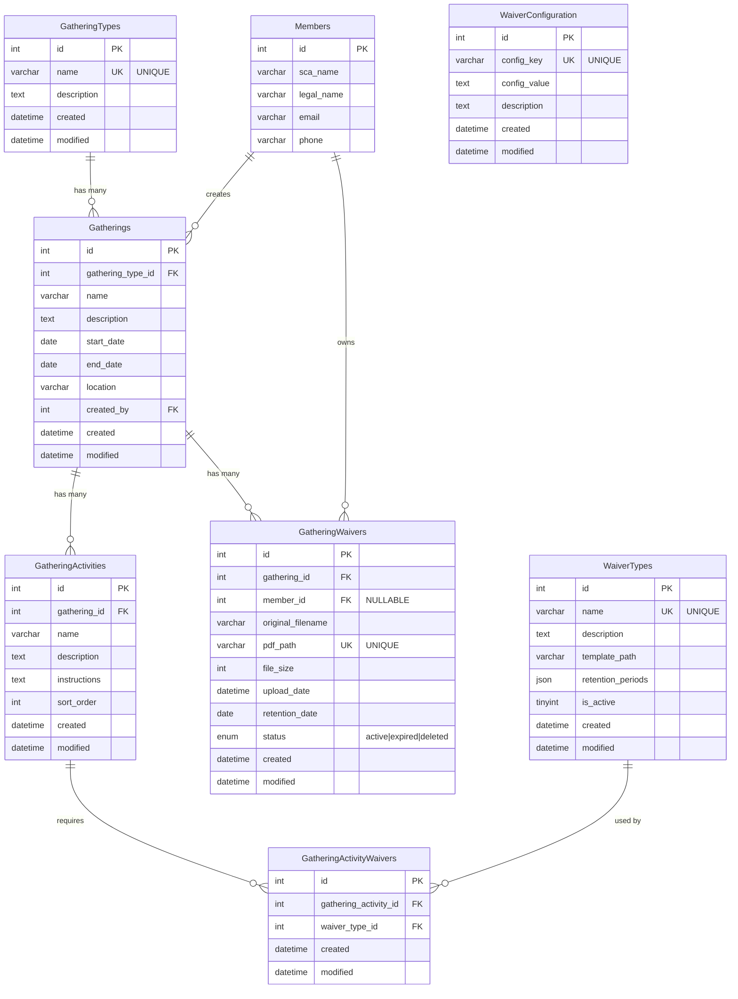
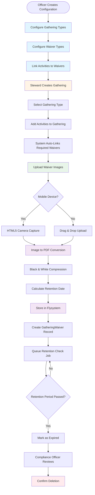
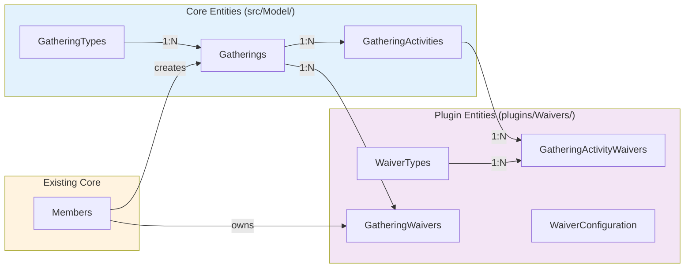

# Data Model - Gathering Waiver Tracking System
**Feature**: 001-build-out-waiver  
**Date**: 2025-06-19  
**Phase**: 1 - Design

## Overview

This document defines the complete data model for the Gathering Waiver Tracking System, including both core entities and plugin-specific entities.

---

## Entity Relationship Diagram (ERD)

### Mermaid Diagram



### Visual Summary

**Core Entities** (broadly reusable):
- `GatheringTypes` → `Gatherings` → `GatheringActivities`

**Plugin Entities** (waiver-specific):
- `WaiverTypes` ↔ `GatheringActivityWaivers` ↔ `GatheringActivities`
- `GatheringWaivers` (uploaded PDFs)
- `WaiverConfiguration` (plugin settings)

**Cross-References**:
- `Members` create `Gatherings` and own `GatheringWaivers`
- `Gatherings` have `GatheringWaivers` (uploaded documents)

### Workflow Diagram



### Simplified Relationship Diagram



---

## Core Entities (in `src/Model/`)

### 1. GatheringTypes

**Purpose**: Define types of gatherings (practices, tournaments, meetings, feasts, wars)

**Table**: `gathering_types`

| Column      | Type         | Attributes                          | Description                        |
|-------------|--------------|-------------------------------------|------------------------------------|
| id          | INT          | PRIMARY KEY, AUTO_INCREMENT         | Unique identifier                  |
| name        | VARCHAR(100) | NOT NULL, UNIQUE                    | Type name (e.g., "Practice")       |
| description | TEXT         | NULL                                | Detailed description               |
| created     | DATETIME     | NOT NULL, DEFAULT CURRENT_TIMESTAMP | Record creation timestamp          |
| modified    | DATETIME     | NOT NULL, DEFAULT CURRENT_TIMESTAMP | Last modification timestamp        |

**Indexes**:
- PRIMARY KEY: `id`
- UNIQUE: `name`

**Validation Rules**:
- `name`: Required, max 100 chars, unique
- `description`: Optional, plain text

**Sample Data**:
```php
['name' => 'Practice', 'description' => 'Regular fighter practice']
['name' => 'Tournament', 'description' => 'Competitive fighting event']
['name' => 'Meeting', 'description' => 'Branch business meeting']
['name' => 'Feast', 'description' => 'Social feast event']
['name' => 'War', 'description' => 'Multi-day SCA war event']
```

---

### 2. Gatherings

**Purpose**: Represent specific gathering instances (e.g., "June 2025 Practice", "Crown Tournament 2025")

**Table**: `gatherings`

| Column            | Type         | Attributes                          | Description                        |
|-------------------|--------------|-------------------------------------|------------------------------------|
| id                | INT          | PRIMARY KEY, AUTO_INCREMENT         | Unique identifier                  |
| gathering_type_id | INT          | NOT NULL, FOREIGN KEY               | FK to gathering_types.id           |
| name              | VARCHAR(200) | NOT NULL                            | Gathering name                     |
| description       | TEXT         | NULL                                | Detailed description               |
| start_date        | DATE         | NOT NULL                            | Gathering start date               |
| end_date          | DATE         | NOT NULL                            | Gathering end date                 |
| location          | VARCHAR(200) | NULL                                | Physical location                  |
| created_by        | INT          | NOT NULL, FOREIGN KEY               | FK to members.id (creator)         |
| created           | DATETIME     | NOT NULL, DEFAULT CURRENT_TIMESTAMP | Record creation timestamp          |
| modified          | DATETIME     | NOT NULL, DEFAULT CURRENT_TIMESTAMP | Last modification timestamp        |

**Indexes**:
- PRIMARY KEY: `id`
- FOREIGN KEY: `gathering_type_id` → `gathering_types.id`
- FOREIGN KEY: `created_by` → `members.id`
- INDEX: `start_date`, `end_date` (for date range queries)
- INDEX: `gathering_type_id` (for filtering by type)

**Validation Rules**:
- `gathering_type_id`: Required, must exist in `gathering_types`
- `name`: Required, max 200 chars
- `start_date`: Required, valid date
- `end_date`: Required, valid date, must be >= `start_date`
- `location`: Optional, max 200 chars
- `created_by`: Required, must exist in `members`

**Sample Data**:
```php
[
    'gathering_type_id' => 1, // Practice
    'name' => 'June 2025 Armored Combat Practice',
    'start_date' => '2025-06-15',
    'end_date' => '2025-06-15',
    'location' => 'City Park, Springfield',
    'created_by' => 42
]
```

---

### 3. GatheringActivities

**Purpose**: Define activities within a gathering that require specific waivers (e.g., "Armored Combat", "Archery")

**Table**: `gathering_activities`

| Column       | Type         | Attributes                          | Description                        |
|--------------|--------------|-------------------------------------|------------------------------------|
| id           | INT          | PRIMARY KEY, AUTO_INCREMENT         | Unique identifier                  |
| gathering_id | INT          | NOT NULL, FOREIGN KEY               | FK to gatherings.id                |
| name         | VARCHAR(200) | NOT NULL                            | Activity name                      |
| description  | TEXT         | NULL                                | Detailed description               |
| instructions | TEXT         | NULL                                | Activity-specific instructions     |
| sort_order   | INT          | NOT NULL, DEFAULT 0                 | Display order                      |
| created      | DATETIME     | NOT NULL, DEFAULT CURRENT_TIMESTAMP | Record creation timestamp          |
| modified     | DATETIME     | NOT NULL, DEFAULT CURRENT_TIMESTAMP | Last modification timestamp        |

**Indexes**:
- PRIMARY KEY: `id`
- FOREIGN KEY: `gathering_id` → `gatherings.id` (ON DELETE CASCADE)
- INDEX: `gathering_id, sort_order` (for ordered activity lists)

**Validation Rules**:
- `gathering_id`: Required, must exist in `gatherings`
- `name`: Required, max 200 chars
- `description`: Optional, plain text
- `instructions`: Optional, plain text
- `sort_order`: Required, integer >= 0

**Sample Data**:
```php
[
    'gathering_id' => 1,
    'name' => 'Armored Combat',
    'instructions' => 'All participants must have authorized armor',
    'sort_order' => 1
]
[
    'gathering_id' => 1,
    'name' => 'Archery',
    'instructions' => 'Range safety briefing required before participation',
    'sort_order' => 2
]
```

---

## Plugin Entities (in `plugins/Waivers/src/Model/`)

### 4. WaiverTypes

**Purpose**: Define types of waivers (Adult General, Minor General, Armored Combat, Equestrian)

**Table**: `waiver_types`

| Column            | Type         | Attributes                          | Description                        |
|-------------------|--------------|-------------------------------------|------------------------------------|
| id                | INT          | PRIMARY KEY, AUTO_INCREMENT         | Unique identifier                  |
| name              | VARCHAR(100) | NOT NULL, UNIQUE                    | Waiver type name                   |
| description       | TEXT         | NULL                                | Detailed description               |
| template_path     | VARCHAR(255) | NULL                                | Path to blank waiver template      |
| retention_periods | JSON         | NOT NULL                            | Retention policy (JSON array)      |
| is_active         | TINYINT(1)   | NOT NULL, DEFAULT 1                 | Active status                      |
| created           | DATETIME     | NOT NULL, DEFAULT CURRENT_TIMESTAMP | Record creation timestamp          |
| modified          | DATETIME     | NOT NULL, DEFAULT CURRENT_TIMESTAMP | Last modification timestamp        |

**Indexes**:
- PRIMARY KEY: `id`
- UNIQUE: `name`
- INDEX: `is_active` (for filtering active waivers)

**Validation Rules**:
- `name`: Required, max 100 chars, unique
- `description`: Optional, plain text
- `template_path`: Optional, max 255 chars, valid file path
- `retention_periods`: Required, valid JSON array of `{amount: INT, unit: STRING}`
- `is_active`: Required, boolean (0 or 1)

**Sample Data**:
```php
[
    'name' => 'Adult General Waiver',
    'description' => 'Standard adult participation waiver',
    'retention_periods' => json_encode([
        ['amount' => 7, 'unit' => 'years'],
        ['amount' => 6, 'unit' => 'months']
    ]),
    'is_active' => 1
]
[
    'name' => 'Armored Combat Waiver',
    'description' => 'Additional waiver for heavy combat participation',
    'retention_periods' => json_encode([
        ['amount' => 10, 'unit' => 'years']
    ]),
    'is_active' => 1
]
```

**Retention Periods JSON Schema**:
```json
[
  {
    "amount": 7,
    "unit": "years"
  },
  {
    "amount": 6,
    "unit": "months"
  }
]
```

---

### 5. GatheringActivityWaivers

**Purpose**: Associate activities with required waiver types (many-to-many join table)

**Table**: `gathering_activity_waivers`

| Column                 | Type     | Attributes                          | Description                        |
|------------------------|----------|-------------------------------------|------------------------------------|
| id                     | INT      | PRIMARY KEY, AUTO_INCREMENT         | Unique identifier                  |
| gathering_activity_id  | INT      | NOT NULL, FOREIGN KEY               | FK to gathering_activities.id      |
| waiver_type_id         | INT      | NOT NULL, FOREIGN KEY               | FK to waiver_types.id              |
| created                | DATETIME | NOT NULL, DEFAULT CURRENT_TIMESTAMP | Record creation timestamp          |
| modified               | DATETIME | NOT NULL, DEFAULT CURRENT_TIMESTAMP | Last modification timestamp        |

**Indexes**:
- PRIMARY KEY: `id`
- FOREIGN KEY: `gathering_activity_id` → `gathering_activities.id` (ON DELETE CASCADE)
- FOREIGN KEY: `waiver_type_id` → `waiver_types.id`
- UNIQUE: `gathering_activity_id, waiver_type_id` (prevent duplicates)

**Validation Rules**:
- `gathering_activity_id`: Required, must exist in `gathering_activities`
- `waiver_type_id`: Required, must exist in `waiver_types`
- Combination must be unique

**Sample Data**:
```php
[
    'gathering_activity_id' => 1, // Armored Combat
    'waiver_type_id' => 1 // Adult General Waiver
]
[
    'gathering_activity_id' => 1, // Armored Combat
    'waiver_type_id' => 3 // Armored Combat Waiver
]
```

---

### 6. GatheringWaivers

**Purpose**: Store uploaded waiver PDFs for gathering participants

**Table**: `gathering_waivers`

| Column            | Type         | Attributes                          | Description                         |
|-------------------|--------------|-------------------------------------|-------------------------------------|
| id                | INT          | PRIMARY KEY, AUTO_INCREMENT         | Unique identifier                   |
| gathering_id      | INT          | NOT NULL, FOREIGN KEY               | FK to gatherings.id                 |
| member_id         | INT          | NULL, FOREIGN KEY                   | FK to members.id (if known)         |
| original_filename | VARCHAR(255) | NOT NULL                            | Original uploaded filename          |
| pdf_path          | VARCHAR(255) | NOT NULL                            | Path to stored PDF file             |
| file_size         | INT          | NOT NULL                            | File size in bytes                  |
| upload_date       | DATETIME     | NOT NULL, DEFAULT CURRENT_TIMESTAMP | Timestamp of upload                 |
| retention_date    | DATE         | NOT NULL                            | Calculated expiration date          |
| status            | ENUM         | NOT NULL, DEFAULT 'active'          | 'active', 'expired', 'deleted'      |
| created           | DATETIME     | NOT NULL, DEFAULT CURRENT_TIMESTAMP | Record creation timestamp           |
| modified          | DATETIME     | NOT NULL, DEFAULT CURRENT_TIMESTAMP | Last modification timestamp         |

**Indexes**:
- PRIMARY KEY: `id`
- FOREIGN KEY: `gathering_id` → `gatherings.id`
- FOREIGN KEY: `member_id` → `members.id` (nullable, on delete SET NULL)
- INDEX: `retention_date, status` (for expiration queries)
- INDEX: `gathering_id` (for gathering-specific queries)
- INDEX: `member_id` (for member-specific queries)

**Validation Rules**:
- `gathering_id`: Required, must exist in `gatherings`
- `member_id`: Optional, must exist in `members` if provided
- `original_filename`: Required, max 255 chars
- `pdf_path`: Required, max 255 chars, unique
- `file_size`: Required, integer > 0
- `upload_date`: Required, valid datetime
- `retention_date`: Required, valid date, must be > `upload_date`
- `status`: Required, one of: 'active', 'expired', 'deleted'

**Status Values**:
- `active`: Waiver is valid and accessible
- `expired`: Retention period passed, eligible for deletion
- `deleted`: Waiver has been permanently deleted (soft delete marker)

**Sample Data**:
```php
[
    'gathering_id' => 1,
    'member_id' => 123,
    'original_filename' => 'john_smith_waiver_001.jpg',
    'pdf_path' => 'waivers/2025/06/abc123def456.pdf',
    'file_size' => 245680,
    'upload_date' => '2025-06-15 14:30:00',
    'retention_date' => '2032-12-15', // 7 years 6 months from gathering end
    'status' => 'active'
]
```

---

### 7. WaiverConfiguration

**Purpose**: Store global configuration settings for the Waivers plugin

**Table**: `waiver_configuration`

| Column       | Type         | Attributes                          | Description                        |
|--------------|--------------|-------------------------------------|------------------------------------|
| id           | INT          | PRIMARY KEY, AUTO_INCREMENT         | Unique identifier                  |
| config_key   | VARCHAR(100) | NOT NULL, UNIQUE                    | Configuration key                  |
| config_value | TEXT         | NULL                                | Configuration value (JSON or text) |
| description  | TEXT         | NULL                                | Human-readable description         |
| created      | DATETIME     | NOT NULL, DEFAULT CURRENT_TIMESTAMP | Record creation timestamp          |
| modified     | DATETIME     | NOT NULL, DEFAULT CURRENT_TIMESTAMP | Last modification timestamp        |

**Indexes**:
- PRIMARY KEY: `id`
- UNIQUE: `config_key`

**Validation Rules**:
- `config_key`: Required, max 100 chars, unique, alphanumeric with underscores
- `config_value`: Optional, plain text or JSON
- `description`: Optional, plain text

**Sample Configuration Keys**:
```php
['config_key' => 'storage_backend', 'config_value' => 'local'] // or 's3'
['config_key' => 's3_bucket', 'config_value' => 'kmp-waivers']
['config_key' => 's3_region', 'config_value' => 'us-east-1']
['config_key' => 'max_upload_size_mb', 'config_value' => '10']
['config_key' => 'allowed_image_types', 'config_value' => json_encode(['image/jpeg', 'image/png'])]
['config_key' => 'pdf_compression_quality', 'config_value' => '85']
['config_key' => 'retention_check_schedule', 'config_value' => 'daily']
```

---

## Relationships Summary

| Parent Entity        | Relationship | Child Entity              | Type   | Cascade |
|----------------------|--------------|---------------------------|--------|---------|
| GatheringTypes       | has many     | Gatherings                | 1:N    | No      |
| Gatherings           | has many     | GatheringActivities       | 1:N    | Yes     |
| Gatherings           | has many     | GatheringWaivers          | 1:N    | No      |
| GatheringActivities  | has many     | GatheringActivityWaivers  | 1:N    | Yes     |
| WaiverTypes          | has many     | GatheringActivityWaivers  | 1:N    | No      |
| Members              | has many     | Gatherings (as creator)   | 1:N    | No      |
| Members              | has many     | GatheringWaivers          | 1:N    | No      |

---

## Migration from Awards Plugin

The Awards plugin currently uses `award_gatherings` table with these columns:
- `id`, `award_id`, `name`, `location`, `event_date`, `created`, `modified`

**Migration Strategy**:

1. Create new `gatherings` table with schema above
2. Migrate data:
   ```sql
   INSERT INTO gatherings (name, location, start_date, end_date, gathering_type_id, created_by, created, modified)
   SELECT 
       name, 
       location, 
       event_date AS start_date, 
       event_date AS end_date,
       (SELECT id FROM gathering_types WHERE name = 'Award Ceremony' LIMIT 1) AS gathering_type_id,
       1 AS created_by, -- System user
       created,
       modified
   FROM award_gatherings;
   ```
3. Add `gathering_id` column to `awards` table
4. Update foreign key references:
   ```sql
   UPDATE awards a
   INNER JOIN gatherings g ON g.name = (
       SELECT ag.name FROM award_gatherings ag WHERE ag.id = a.award_gathering_id
   )
   SET a.gathering_id = g.id;
   ```
5. Drop `award_gathering_id` column from `awards` table
6. Drop `award_gatherings` table
7. Update Awards plugin code to use `Gatherings` association

---

## Next Steps

1. ✅ Data model complete
2. Next: Create `contracts/` directory with API endpoint specifications
3. Next: Create `quickstart.md` for developer onboarding
4. Next: Update agent context with new entities and patterns
